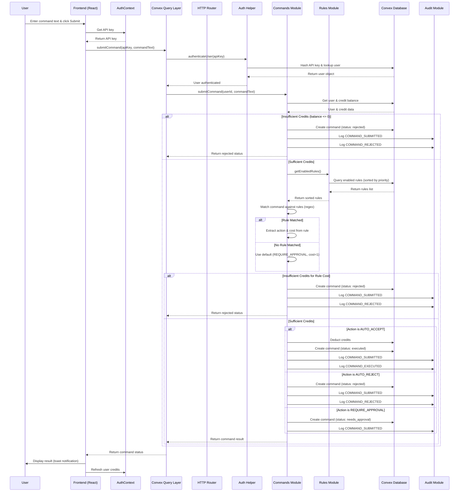
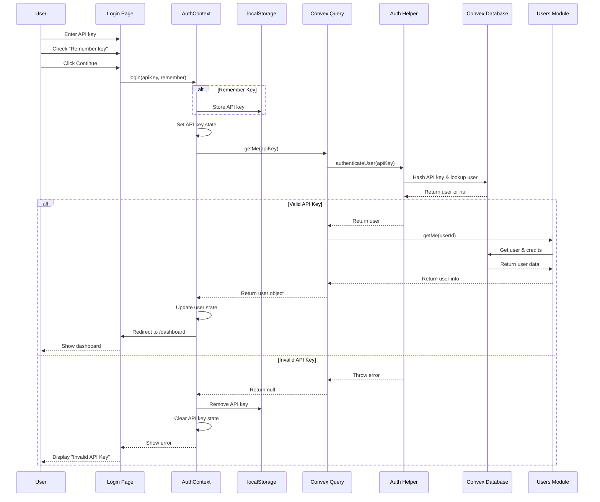
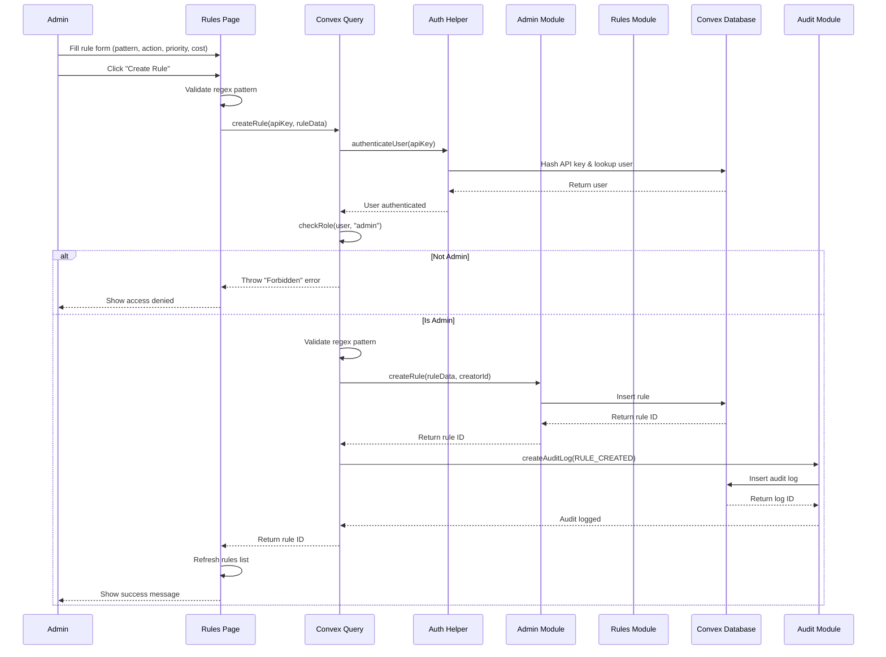
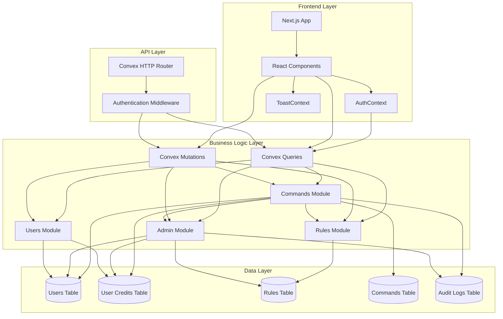

# Command Gateway - System Diagrams

This document contains sequence and class diagrams for the Command Gateway application.

## Sequence Diagram: Command Submission Flow

This diagram shows the complete flow when a user submits a command through the system.



## Sequence Diagram: Authentication Flow

This diagram shows how users authenticate using API keys.



## Sequence Diagram: Admin Creating a Rule

This diagram shows the flow when an admin creates a new rule.



## Class Diagram: Database Schema & Relationships

This diagram shows the database schema, relationships, and key data structures.

```mermaid
classDiagram
    class Users {
        +Id _id
        +string? email
        +number? emailVerificationTime
        +string? phone
        +number? phoneVerificationTime
        +boolean? isAnonymous
        +string? name
        +string? image
        +string? api_key
        +"admin"|"member"? role
        +number? created_at
        +number? updated_at
    }

    class UserCredits {
        +Id _id
        +Id user_id
        +number balance
        +number updated_at
    }

    class Rules {
        +Id _id
        +string pattern
        +"AUTO_ACCEPT"|"AUTO_REJECT"|"REQUIRE_APPROVAL" action
        +number? priority
        +number? cost
        +Id created_by
        +number created_at
        +boolean enabled
    }

    class Commands {
        +Id _id
        +Id user_id
        +string command_text
        +"pending"|"executed"|"rejected"|"needs_approval" status
        +Id? matched_rule_id
        +number cost
        +number created_at
        +number? executed_at
        +string? rejection_reason
        +string? output
    }

    class AuditLogs {
        +Id _id
        +Id user_id
        +Id? command_id
        +string event_type
        +any details
        +number created_at
    }

    class AuthContext {
        +User? user
        +boolean isAuthenticated
        +boolean isLoading
        +string? apiKey
        +login(key, remember)
        +logout()
        +refreshUser()
    }

    class ApiClient {
        -string? apiKey
        +setApiKey(key)
        +getApiKey()
        +clearApiKey()
        +request(endpoint, options)
        +get(endpoint, params)
        +post(endpoint, body)
        +patch(endpoint, body)
        +delete(endpoint)
    }

    class ConvexQueries {
        +getMe(apiKey)
        +listUsers(apiKey)
        +createUser(apiKey, userData)
        +adjustCredits(apiKey, userId, amount)
        +listRules(apiKey)
        +createRule(apiKey, ruleData)
        +updateRule(apiKey, ruleId, updates)
        +deleteRule(apiKey, ruleId)
        +submitCommand(apiKey, commandText)
        +listCommands(apiKey, status?)
        +getAuditLogs(apiKey, filters)
    }

    class CommandsModule {
        +submitCommand(userId, commandText)
        +listCommands(userId?, status?)
        +getCommand(commandId)
    }

    class RulesModule {
        +getEnabledRules()
        +listRules()
        +getRule(ruleId)
        +updateRule(ruleId, updates)
        +deleteRule(ruleId)
    }

    class AdminModule {
        +createApiUser(email, name, role)
        +listUsers()
        +createRule(ruleData, creatorId)
        +adjustCredits(userId, amount, reason)
        +createAuditLog(userId, eventType, details)
        +getAuditLogs(filters)
    }

    class HTTPRouter {
        +route(path, method, handler)
        +authenticatedRoute(handler, requiredRole?)
    }

    Users ||--o{ UserCredits : "has one"
    Users ||--o{ Commands : "submits"
    Users ||--o{ Rules : "creates"
    Users ||--o{ AuditLogs : "generates"
    Rules ||--o{ Commands : "matches"
    Commands ||--o{ AuditLogs : "triggers"
    
    AuthContext --> ConvexQueries : "uses"
    ConvexQueries --> CommandsModule : "calls"
    ConvexQueries --> RulesModule : "calls"
    ConvexQueries --> AdminModule : "calls"
    HTTPRouter --> ConvexQueries : "routes to"
    CommandsModule --> RulesModule : "queries"
    CommandsModule --> AdminModule : "logs to"
    AdminModule --> RulesModule : "creates"
```

## Class Diagram: Frontend Components

This diagram shows the React component structure and relationships.

```mermaid
classDiagram
    class AppProviders {
        +children
        +render()
    }

    class ConvexClientProvider {
        +children
        +render()
    }

    class AuthProvider {
        -string? apiKey
        -User? user
        -boolean isLoading
        +login(key, remember)
        +logout()
        +refreshUser()
    }

    class ToastProvider {
        -Toast[] toasts
        +addToast(message, type)
        +removeToast(id)
    }

    class DashboardLayout {
        +children
        +render()
    }

    class Sidebar {
        +User? user
        +render()
    }

    class TopBar {
        +User? user
        +logout()
        +render()
    }

    class DashboardPage {
        +render()
        +fetchStatistics()
    }

    class CommandsPage {
        -string commandText
        -string statusFilter
        +handleSubmit()
        +render()
    }

    class UsersPage {
        -User[] users
        +handleCreateUser()
        +handleAdjustCredits()
        +render()
    }

    class RulesPage {
        -Rule[] rules
        +handleCreateRule()
        +handleUpdateRule()
        +handleDeleteRule()
        +render()
    }

    class AuditPage {
        -AuditLog[] logs
        -filters
        +handleFilter()
        +render()
    }

    class Button {
        +variant
        +size
        +onClick
        +children
    }

    class Card {
        +children
    }

    class Table {
        +data
        +columns
    }

    class Modal {
        +isOpen
        +onClose
        +children
    }

    AppProviders --> ConvexClientProvider : "wraps"
    AppProviders --> AuthProvider : "wraps"
    AppProviders --> ToastProvider : "wraps"
    
    DashboardLayout --> Sidebar : "contains"
    DashboardLayout --> TopBar : "contains"
    
    DashboardPage --> AuthProvider : "uses"
    CommandsPage --> AuthProvider : "uses"
    CommandsPage --> ToastProvider : "uses"
    UsersPage --> AuthProvider : "uses"
    UsersPage --> ToastProvider : "uses"
    RulesPage --> AuthProvider : "uses"
    RulesPage --> ToastProvider : "uses"
    AuditPage --> AuthProvider : "uses"
    
    CommandsPage --> Button : "uses"
    CommandsPage --> Card : "uses"
    CommandsPage --> Table : "uses"
    UsersPage --> Button : "uses"
    UsersPage --> Card : "uses"
    UsersPage --> Table : "uses"
    UsersPage --> Modal : "uses"
    RulesPage --> Button : "uses"
    RulesPage --> Card : "uses"
    RulesPage --> Table : "uses"
    RulesPage --> Modal : "uses"
    AuditPage --> Card : "uses"
    AuditPage --> Table : "uses"
```



## System Architecture Overview



## Key Relationships Summary

### Database Relationships
- **Users** → **UserCredits**: One-to-One (each user has one credit record)
- **Users** → **Commands**: One-to-Many (each user can submit many commands)
- **Users** → **Rules**: One-to-Many (each admin can create many rules)
- **Users** → **AuditLogs**: One-to-Many (each user generates many audit logs)
- **Rules** → **Commands**: One-to-Many (each rule can match many commands)
- **Commands** → **AuditLogs**: One-to-Many (each command can generate multiple audit logs)

### Authentication Flow
1. User provides API key
2. API key is hashed (SHA-256)
3. Hashed key is looked up in Users table
4. User object is returned with role and credits
5. Role-based access control is enforced

### Command Processing Flow
1. Validate user credits
2. Fetch enabled rules (sorted by priority)
3. Match command text against rule patterns (regex)
4. Determine action (AUTO_ACCEPT, AUTO_REJECT, REQUIRE_APPROVAL)
5. Deduct credits (if AUTO_ACCEPT)
6. Create command record
7. Create audit log entries

### Rule Matching Algorithm
1. Rules are sorted by priority (descending)
2. Command text is tested against each rule's regex pattern
3. First matching rule wins
4. If no match, default to REQUIRE_APPROVAL with cost=1

